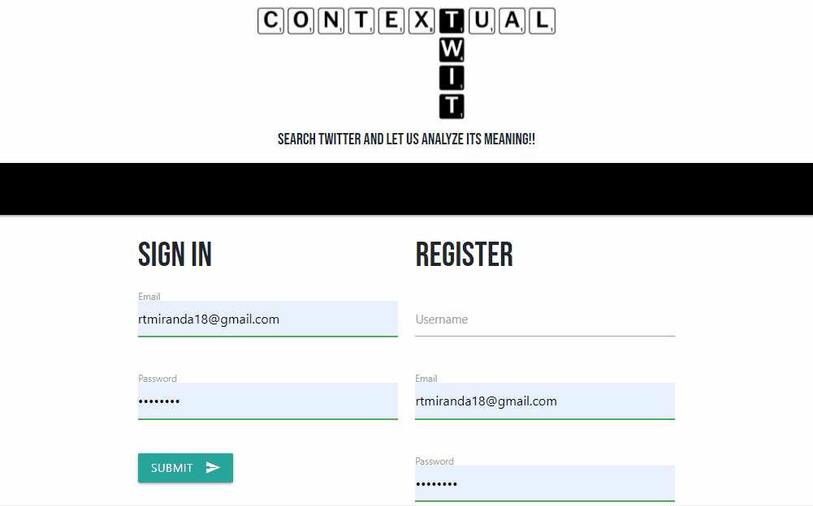
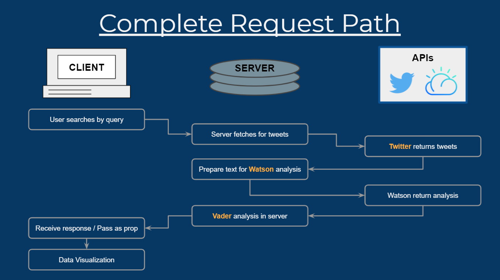

# Contextual Twit

## Summary
Contextual Twit is a tool that can get the most recent tweets by any topic and help you find insight with sentiment analysis. With this app, the user can see trending topics on Twitter. Users can also search Tweets by query and the app will display an visualized sentiment analysis powered by [IBM Watson](https://www.ibm.com/watson/services/tone-analyzer/) and [VADER Sentiment](https://pypi.org/project/vaderSentiment/). This app can help companies and individuals for marketing research, development, etc. Visit the application [HERE](https://tranquil-castle-82838.herokuapp.com/). 



## Technologies Used
- CSS - used to style an HTML document
- Javascript - adds special effects on pages
- Node.js - an open source server environment that uses JavaScript on the server
- Express - a Node.js web application framework that provides a robust set of features for web and mobile applications.
- MongoDB - stores data in JSON-like documents. 
- Mongoose - Used with MongoDB
- [dotenv](https://www.npmjs.com/package/dotenv) - used for hidding API keys
- [bcrypt](https://www.npmjs.com/package/bcrypt) - Used for encrypting passwords
- [React](https://reactjs.org/) - a JavaScript library for building user interfaces
- [React Promise tracker](https://www.npmjs.com/package/react-promise-tracker) - Used to track a promise and wait until it is resolved
- [React-Loader-Spinner](https://www.npmjs.com/package/react-loader-spinner) - Used on the client side to render a loading icon while a promise is resolved
- [React-flexible-sliding-menu](https://www.npmjs.com/package/react-flexible-sliding-menu) - Used to create the toggle menu 
- [Chart.js](https://www.chartjs.org/docs/latest/) - allows you to easily make graphs to display data
- [Twitter API v1.1](https://developer.twitter.com/en/docs/twitter-api/v1/tweets/search/overview) - returns a collection of relevant Tweets matching a specified query
- [VADER Setiment](https://github.com/vaderSentiment/vaderSentiment-js) - sentiment analysis tool that is specifically attuned to sentiments expressed in social media
- [Watson Tone Analyzer](https://www.ibm.com/watson/services/tone-analyzer/) - IBM's AI powered linguistic analysis tool for detecting emotional and language tones in written text
- GitBash - for cloning repository and pushing code to GitHub
- GitHub - holds repository that deploys to GitHub Pages

## Code Snippet
The following diagram and code snippet show how tweets are fetched and analyized for sentiment data.


```javascript
// Get Tweets
getTwits: function (req, res) {
    client.get('search/tweets', { q: `${req.body.thekey}`, lang: 'en', count: 50 }, function (error, tweets, response) {

        const data = [];
        const toneChatParams = { utterances: [] };

        tweets.statuses.forEach(function (tweet) {
            toneChatParams.utterances.push({
                text: tweet.text.replace(/(\r\n|\n|\r)/gm, " "),
            });
        });

        // Watson-Sentiment
        toneAnalyzer.toneChat(toneChatParams)
        .then(utteranceAnalyses => {
            for (let i = 0; i < tweets.statuses.length; i++) {

            // Vader-Sentiment
            let intensity = vader.SentimentIntensityAnalyzer.polarity_scores(toneChatParams.utterances[i].text);

            if (toneChatParams.utterances[i].text === utteranceAnalyses.result.utterances_tone[i].utterance_text) {
                data.push({
                id: i,
                created_at: tweets.statuses[i].created_at,
                id_str: tweets.statuses[i].id_str,
                screen_name: tweets.statuses[i].user.screen_name,
                followers_count: tweets.statuses[i].user.followers_count,
                user_verified: tweets.statuses[i].user.verified,
                is_quote_status: tweets.statuses[i].is_quote_status,
                retweet_count: tweets.statuses[i].retweet_count,
                favorite_count: tweets.statuses[i].favorite_count,
                hashtags: tweets.statuses[i].entities.hashtags,
                lang: tweets.statuses[i].lang,
                text: utteranceAnalyses.result.utterances_tone[i].utterance_text,
                watson_tones: utteranceAnalyses.result.utterances_tone[i].tones,
                vader_intensity: intensity
                });
            } else {
                data.push({
                id: i,
                created_at: tweets.statuses[i].created_at,
                id_str: tweets.statuses[i].id_str,
                screen_name: tweets.statuses[i].user.screen_name,
                followers_count: tweets.statuses[i].user.followers_count,
                user_verified: tweets.statuses[i].user.verified,
                is_quote_status: tweets.statuses[i].is_quote_status,
                retweet_count: tweets.statuses[i].retweet_count,
                favorite_count: tweets.statuses[i].favorite_count,
                hashtags: tweets.statuses[i].entities.hashtags,
                lang: tweets.statuses[i].lang,
                text: toneChatParams.utterances[i].text,
                watson_tones: [],
                vader_intensity: intensity
                });
            };
            };
            res.json(data)// <=== Data to deliver here!
        })
        .catch(err => {
            console.log('error:', err);
        });
    })
}
```

---

## Author Links 

Mark Khoo <br />
[Linkedin](https://github.com/markkhoo) <br />
[Github](https://www.linkedin.com/in/markdkhoo/)

Javier Mondragon <br />
[Linkedin](https://www.linkedin.com/in/javier-mondragon-7b471719b/) <br />
[Github](https://github.com/javimarashall)

Manuel Villasenor <br />
[LinkedIn](https://www.linkedin.com/in/manuel-villasenor-854186205/)<br />
[GitHub](https://github.com/manuelvrsr)

Rosario Miranda <br />
[LinkedIn](https://www.linkedin.com/in/rosario-miranda-b81170132/)<br />
[GitHub](https://github.com/rtmiranda18)

